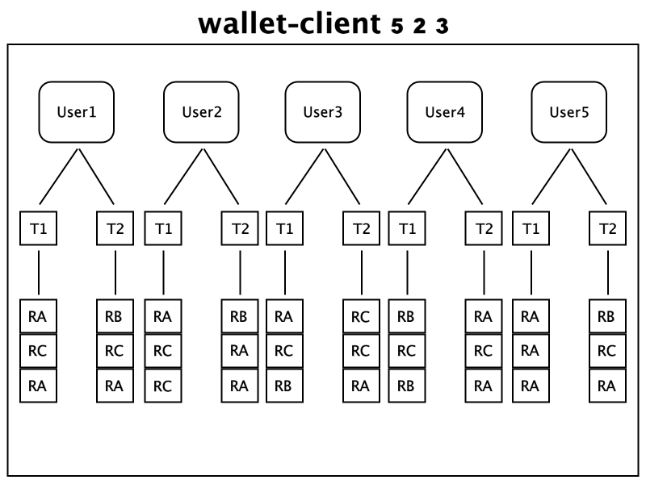

Wallet-Project - SergioNGCR
========================================

Wallet-Project contains a java gRPC library project, the Wallet-Server project an app 
with gRPC endpoints for Users to deposit, withdraw and check their wallet balances and 
the Wallet-Client project an app that simulates Users making requests to the server.

Requirements
========================================

Java should be installed on the machine, at least java 1.8.0_212, if running the 
applications on local machine.

For the project to work on your machine you need Docker installed and running, as the 
project makes use of docker-compose for downloading and running the MySQL server and 
Adminer for DB administration, ports 33306 and 9898 should be available for these two
programs to run properly.

Port 59090 should be available as it is needed for the Wallet-Server application.

No proxy settings are taken into account, please do all necessary changes if you use
a proxy for your internet connection.

How to Run
========================================

### Basic setup and running DB:

1. Clone the repository to machine.
2. Open a Terminal and navigate to the project's root folder.
3. Execute docker network command to create a network for wallet-project containers.
    ```
    docker network create wallet-project-sergio
    ```
4. Execute docker-compose to download and start the MySQL instance. (use -d for detached)
    ```
    docker-compose up -d
    ```
5. If running detached, check docker ps for when MySQL is up and running.
6. You can additionally login to Adminer on http://localhost:9898.
   ```
   Username: root
   Password: test
   database: wallet
   ```
7. Once you can login to the database, you can proceed.

### Building projects:

1. Still on the project root folder.
2. Run `./gradlew build`.
3. This should compile the code for all 3 projects and run unit and integration tests.

### Run Wallet-Server:

1. Still on the project root folder.
2. Run `./gradlew :wallet-server:docker` to build the docker image named 
'wallet-server-sergio'
3. To start the 'wallet-server-sergio' container run:
    ```
    docker run --rm -p 59090:59090 --network wallet-project-sergio --name wallet-server-sergio wallet-server-sergio
    ```
    3.2. If you want to run 'wallet-server-sergio' locally run: 
    `java -jar wallet-server/build/libs/wallet-server-1.0.jar`
4. Server should start and when ready it should be listening on port 59090.
    ```
    If everything is good you should see a log message like:
    - gRPC Server started, listening on address: *, port: 59090

    You might get this error if port not available:
    - java.net.BindException: Address already in use
    ```
5. To exit the server just press Ctrl+C or ^C.

### Run Wallet-Client:

1. Open a new Terminal and navigate to the project's root folder.
2. Run `./gradlew :wallet-client:docker`  to build the docker image named 
'wallet-client-sergio'
3. Run the following command, replace `<users>` with the amount of users to simulate, 
`<threadPerUser>` with the number of threads allowed per user and `<roundsPerThread>` 
with the number of rounds each thread has to execute.
    ```
    docker run --rm --network wallet-project-sergio wallet-client-sergio <users> <threadPerUser> <roundsPerThread>
    ``` 
    3.2. If you want to run 'wallet-client-sergio' locally run:
    ```
    java -jar wallet-client/build/libs/wallet-client-1.0.jar <users> <threadPerUser> <roundsPerThread>
    ```
4. Client application should start and simulate multiple users making requests to 
the Wallet-Server, debug messages will indicate the start and finish of the simulation
and will show users making the requests, when simulation finishes the application will 
exit.
5. If you want to hide all the debug messages just run the same commands with an 
additional option as shown below, this could be useful when simulating more than 20 
Users and you only need the start and finish times or don't care for User's output:
    ```
    docker run --rm --network wallet-project-sergio wallet-client-sergio <users> <threadPerUser> <roundsPerThread> --logging.level.com=INFO
    
    or
   
    java -jar wallet-client/build/libs/wallet-client-1.0.jar <users> <threadPerUser> <roundsPerThread> --logging.level.com=INFO
    ```

Important Project Choices
========================================

* Docker usage for Database, Client and Server applications, helping streamlining
deployment on any machine or environment.
* Client and Server applications are based on Spring Boot 2, simplifying the
initial project setup and avoiding much boiler-plate code.
* Decided to use [grpc-spring-boot-starter](https://github.com/yidongnan/grpc-spring-boot-starter) 
for handling the gRPC Server and Client implementations, seemed to have more 
development and features than other available options. 
* JUnit 4 is used for unit tests with hamcrest library for assertions, tried 
to use JUnit 5 but fund many issues and couldn't get tests to run properly, 
had to rollback to JUnit 4.
* Usage of Hibernate with spring-boot-starter-data-jpa for DB connection and 
repository implementations.
* For the Wallet-Client simulation the following design is the base idea on how
the simulation should execute, important to note as my interpretation of the 
test task definition might be different than expected:



Performance Estimations
========================================

The whole solution was thoroughly tested doing unit, integration and stress testing, 
you can find in the file `test_results.txt` information about some of the stress tests 
done and the results.

My final estimations are based on the results from that file, the Wallet-Server is able 
to process around 76 requests per second under heavy loads, this makes it likely
capable of serving up to 6.6 million requests in 24 hours, meaning that if an average of
6.6 requests per User is taken into account (based on the Rounds from the Wallet-Client 
app) the Wallet-Server could serve up to 1 million users daily.